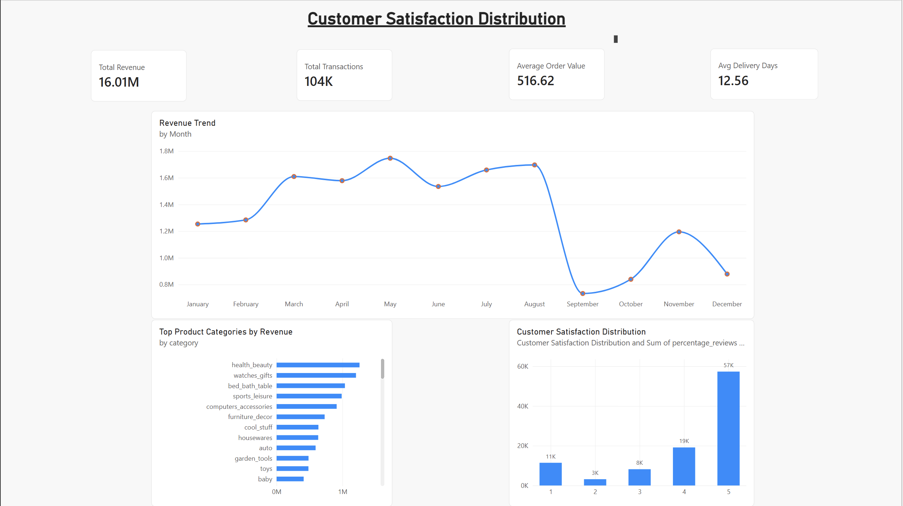
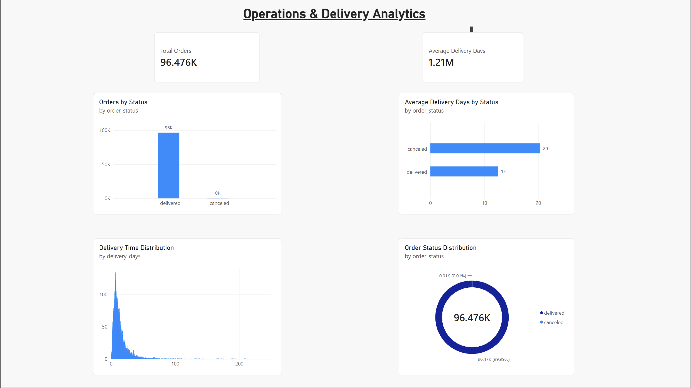
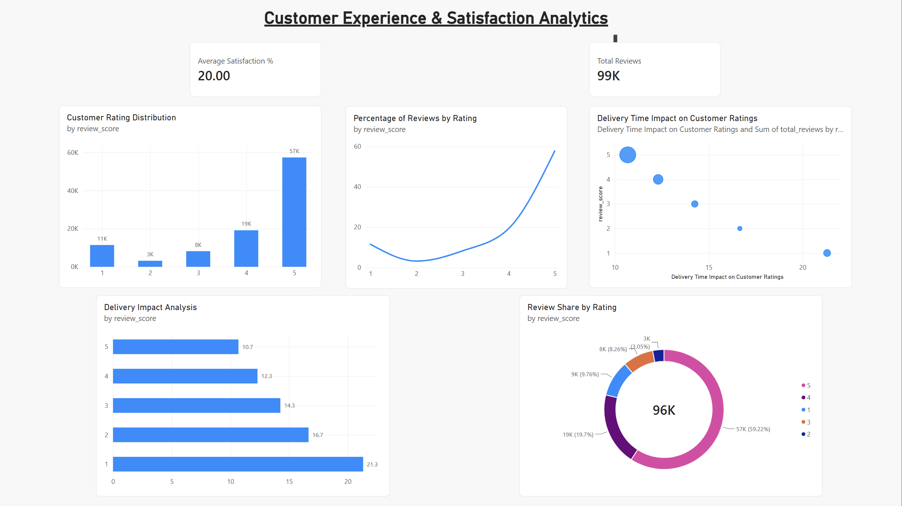
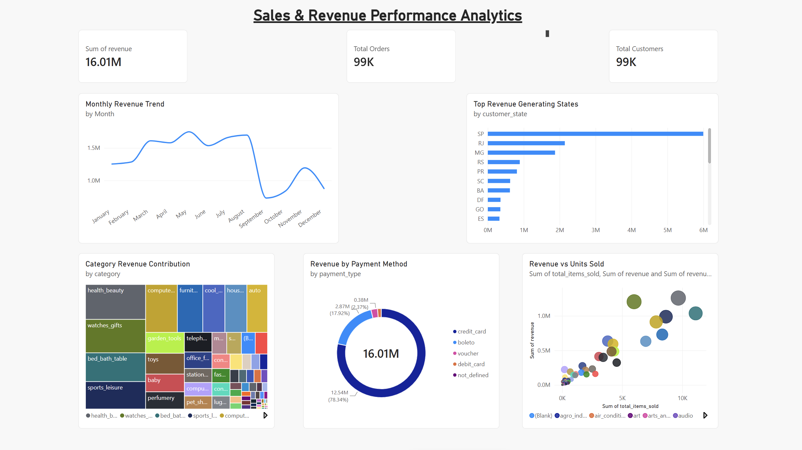

# InsightFlow
### End-to-End E-Commerce Analytics & Business Intelligence Platform

[Project Banner Image]

---

## Overview

InsightFlow is a complete Business Intelligence and Analytics platform built using PostgreSQL, Docker, SQL, and Power BI.

The project transforms raw e-commerce transaction data into actionable business insights through a structured analytics workflow that includes:

- Data Warehousing
- ETL Processing
- Data Quality Validation
- KPI Engineering
- Analytics Views
- Interactive Power BI Dashboards

Built using the Brazilian Olist E-Commerce Dataset containing over 1.5 million records.

---

## Business Problem

Modern e-commerce companies generate data from:

- Customers
- Orders
- Payments
- Reviews
- Sellers
- Logistics

Without a centralized analytics solution it becomes difficult to:

- Track revenue performance
- Monitor customer satisfaction
- Analyze delivery efficiency
- Understand payment behavior
- Measure regional sales performance

InsightFlow solves this by creating a complete analytics environment capable of supporting executive decision making.

---

## Tech Stack

### Data Engineering

- PostgreSQL
- SQL
- Docker

### Analytics

- Data Modeling
- ETL Development
- KPI Layer
- Data Validation

### Visualization

- Power BI

### Version Control

- Git
- GitHub

---

## Dataset

Brazilian Olist E-Commerce Dataset

| Entity | Records |
|----------|----------:|
| Customers | 99,441 |
| Orders | 99,441 |
| Products | 32,951 |
| Sellers | 3,095 |
| Payments | 103,886 |
| Reviews | 99,224 |

Total Records Processed:

**1.5M+**

---

# Architecture

Raw Data
↓
ETL Layer
↓
PostgreSQL Warehouse
↓
Data Validation
↓
Business KPI Layer
↓
Analytics Views
↓
Power BI Dashboards

---

# Power BI Dashboards

## 1. Executive Overview Dashboard

Provides a high-level business snapshot.

### KPIs

- Total Revenue
- Total Transactions
- Average Order Value
- Average Delivery Time

### Insights

- Monthly Revenue Trends
- Top Product Categories
- Customer Satisfaction Overview



---

## 2. Customer Experience & Satisfaction Dashboard

Focuses on customer sentiment and review behavior.

### KPIs

- Total Reviews
- Average Satisfaction Score

### Insights

- Review Distribution
- Rating Breakdown
- Delivery Impact on Ratings



---

## 3. Operations & Delivery Analytics Dashboard

Measures operational efficiency.

### KPIs

- Total Orders
- Average Delivery Days

### Insights

- Order Status Distribution
- Delivery Time Analysis
- Delivery Performance by Status



---

## 4. Sales & Revenue Performance Dashboard

Analyzes revenue generation patterns.

### KPIs

- Revenue
- Orders
- Customers

### Insights

- Revenue Trends
- Revenue by State
- Revenue by Category
- Revenue by Payment Method



---

# Key Business Insights

### Revenue

- Generated over 16M in revenue
- Identified top-performing categories
- Discovered high-performing states

### Customer Experience

- Majority of reviews are 4–5 stars
- Faster delivery correlates with higher ratings

### Operations

- Average delivery time: 12.56 days
- Operational bottlenecks identified through status analysis

### Payments

- Credit cards dominate transaction volume
- Payment behavior patterns analyzed

---

# Repository Structure

```text
insightflow/
│
├── data/
├── sql/
├── docs/
│   ├── screenshots/
│   ├── dashboard_guide.md
│   ├── architecture.md
│   ├── schema_design.md
│   └── data_dictionary.md
│
├── powerbi/
│   └── InsightFlow_Dashboard.pbix
│
├── docker-compose.yml
└── README.md
