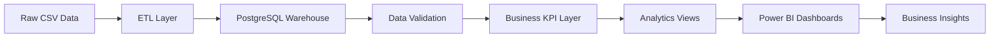

# 🚀 InsightFlow

### End-to-End E-Commerce Analytics & Business Intelligence Platform

Transforming 1.5M+ E-Commerce Records into Executive-Level Business Insights using PostgreSQL, Docker, SQL, and Power BI.


---

# 📋 Table of Contents

- Overview
- Business Problem
- Solution
- Architecture
- Dataset
- Technology Stack
- Key Metrics
- Business Questions Solved
- Power BI Dashboards
- Data Warehouse Design
- Analytics Layer
- Project Structure
- Setup Guide
- Skills Demonstrated
- Future Enhancements
- Author

---

# 📖 Overview

InsightFlow is a complete Business Intelligence and Analytics platform built using:

- PostgreSQL
- SQL
- Docker
- Power BI
- Git & GitHub

The project simulates a real-world analytics environment by transforming raw e-commerce data into actionable business insights through:

- Data Warehousing
- ETL Processing
- Data Validation
- KPI Engineering
- Analytics Views
- Interactive Dashboards

The solution is built using the Brazilian Olist E-Commerce Dataset containing over **1.5 million records**.

---

# 🎯 Business Problem

Modern e-commerce businesses generate large volumes of transactional data across:

- Customers
- Orders
- Products
- Payments
- Reviews
- Sellers
- Logistics

Without a centralized analytics platform, organizations struggle to:

- Monitor revenue performance
- Track customer satisfaction
- Measure delivery efficiency
- Analyze payment behavior
- Identify regional sales trends
- Generate executive-level reports

InsightFlow addresses these challenges by creating a structured analytics warehouse and business intelligence layer capable of transforming raw data into strategic business insights.

---

# 💡 Solution

InsightFlow provides:

✅ Centralized Data Warehouse

✅ Data Validation Layer

✅ Business KPI Layer

✅ Analytics Views

✅ Power BI Dashboards

✅ Executive Decision Support

---

# 🏗 Architecture



---

# 📊 Dataset

### Brazilian Olist E-Commerce Dataset

| Entity | Records |
|----------|----------:|
| Customers | 99,441 |
| Orders | 99,441 |
| Products | 32,951 |
| Sellers | 3,095 |
| Reviews | 99,224 |
| Payments | 103,886 |
| Geolocation | 1,000,163 |

---

### Total Records Processed

# 1.5M+ Records

---

# 🛠 Technology Stack

## Data Engineering

- PostgreSQL
- SQL
- Docker

## Analytics Engineering

- Data Modeling
- Data Validation
- KPI Development
- Query Optimization

## Business Intelligence

- Power BI
- Dashboard Development
- Executive Reporting

## Version Control

- Git
- GitHub

---

# 📈 Key Metrics

| KPI | Value |
|---------|---------:|
| Total Revenue | 16M+ |
| Total Orders | 99K+ |
| Total Customers | 99K+ |
| Total Reviews | 99K+ |
| Products | 32K+ |
| Sellers | 3K+ |
| Records Processed | 1.5M+ |

---

# ❓ Business Questions Solved

### Revenue Analytics

- Which product categories generate the highest revenue?
- Which states contribute the most revenue?
- How does revenue change over time?
- What payment methods generate the most revenue?

### Customer Analytics

- What is the customer satisfaction distribution?
- What percentage of customers leave positive reviews?
- How do delivery times impact customer ratings?

### Operations Analytics

- What is the average delivery time?
- How many orders are delivered vs canceled?
- Which operational bottlenecks impact fulfillment?

### Business Intelligence

- Which regions drive business growth?
- What trends should executives monitor?
- Which KPIs require immediate attention?

---

# 📊 Power BI Dashboard Suite

The project contains four business-focused dashboards.

---

# 1️⃣ Executive Overview Dashboard

### Purpose

Provides a high-level business snapshot for executives and stakeholders.

### KPIs

- Total Revenue
- Total Transactions
- Average Order Value
- Average Delivery Days

### Insights

- Monthly Revenue Trends
- Top Product Categories
- Customer Satisfaction Distribution

### Dashboard Preview


---

# 2️⃣ Customer Experience & Satisfaction Dashboard

### Purpose

Analyzes customer sentiment and review behavior.

### KPIs

- Average Satisfaction %
- Total Reviews

### Insights

- Rating Distribution
- Review Share Analysis
- Delivery Impact on Ratings

### Dashboard Preview


---

# 3️⃣ Operations & Delivery Analytics Dashboard

### Purpose

Measures delivery performance and operational efficiency.

### KPIs

- Total Orders
- Average Delivery Days

### Insights

- Order Status Distribution
- Delivery Time Analysis
- Fulfillment Performance

### Dashboard Preview


---

# 4️⃣ Sales & Revenue Performance Dashboard

### Purpose

Tracks sales performance and revenue generation patterns.

### KPIs

- Revenue
- Customers
- Orders

### Insights

- Revenue Trends
- Revenue by State
- Revenue by Category
- Revenue by Payment Method

### Dashboard Preview


---

# 🗄 Data Warehouse Design

The warehouse was built using a normalized relational schema.

### Core Tables

- customers
- orders
- order_items
- products
- sellers
- payments
- reviews
- geolocation
- category_translation

### Features

- Primary Keys
- Foreign Keys
- Referential Integrity
- Data Validation Constraints

---

# 🔍 Data Validation Layer

Comprehensive validation checks were implemented.

### Validation Performed

- Orphan Order Detection
- Orphan Product Detection
- Orphan Seller Detection
- Orphan Payment Detection
- Orphan Review Detection
- Customer Relationship Validation

### Result

✅ All validation checks passed successfully.

---

# 📈 Analytics Layer

The analytics layer exposes reusable business views.

### Analytics Views

- vw_revenue_by_category
- vw_revenue_by_state
- vw_monthly_revenue
- vw_customer_satisfaction
- vw_payment_analysis
- vw_delivery_performance
- vw_review_delivery_correlation
- vw_seller_performance

These views power the Power BI dashboards and KPI reporting layer.

---

# 💡 Key Business Insights

## Revenue

- Generated over 16M in revenue
- Identified top-performing product categories
- Discovered revenue concentration across regions

## Customer Experience

- Majority of reviews are 4-star and 5-star ratings
- Faster deliveries correlate with better customer satisfaction

## Operations

- Average delivery time is approximately 12.56 days
- Order status analysis reveals operational efficiency patterns

## Payments

- Credit card transactions dominate revenue generation
- Payment behavior varies across customer segments

---

# 📂 Project Structure

```text
insightflow/
│
├── data/
│   ├── raw/
│   └── processed/
│
├── docs/
│   ├── screenshots/
│   │   ├── executive_dashboard.png
│   │   ├── customer_dashboard.png
│   │   ├── operations_dashboard.png
│   │   └── data_quality_dashboard.png
│   │
│   ├── dashboard_01_executive.md
│   ├── dashboard_02_customer_experience.md
│   ├── dashboard_03_operations.md
│   ├── dashboard_04_data_quality.md
│   ├── architecture.md
│   ├── dashboard_guide.md
│   ├── data_dictionary.md
│   ├── etl_pipeline.md
│   └── schema_design.md
│
├── sql/
│
├── powerbi/
│   └── InsightFlow_Dashboard.pbix
│
├── docker-compose.yml
│
└── README.md
```

---

# 🚀 Setup Guide

## Clone Repository

```bash
git clone https://github.com/yourusername/insightflow.git

cd insightflow
```

## Start PostgreSQL Container

```bash
docker compose up -d
```

## Connect to Database

```bash
docker exec -it insightflow-postgres psql -U insight_admin -d insightflow
```

## Open Power BI Dashboard

```text
powerbi/InsightFlow_Dashboard.pbix
```

Open using:

Power BI Desktop

---

# 🧠 Skills Demonstrated

### Data Engineering

- PostgreSQL
- SQL
- Data Warehousing
- ETL Development
- Data Modeling

### Analytics Engineering

- KPI Engineering
- Data Validation
- Query Optimization
- Analytical Views

### Business Intelligence

- Power BI
- Dashboard Design
- Executive Reporting
- Data Visualization

### Software Engineering

- Docker
- Git
- GitHub

---

# 🛣 Project Journey

### Phase 1

✅ Warehouse Design

### Phase 2

✅ Data Loading

### Phase 3

✅ Data Validation

### Phase 4

✅ KPI Layer

### Phase 5

✅ Analytics Views

### Phase 6

✅ Power BI Dashboards

### Phase 7

✅ Documentation

### Phase 8

🚀 Portfolio Deployment

---

# 🔮 Future Enhancements

- Incremental Data Loading
- Automated ETL Pipelines
- Power BI Service Deployment
- Predictive Analytics
- Customer Segmentation
- Revenue Forecasting
- Real-Time Reporting

---

# 🎯 Why This Project Matters

InsightFlow demonstrates the complete analytics lifecycle used by modern data teams:

Raw Data

⬇

ETL Processing

⬇

Data Warehouse

⬇

Data Validation

⬇

KPI Engineering

⬇

Analytics Views

⬇

Power BI Dashboards

⬇

Business Decisions

This mirrors how Data Analysts, BI Analysts, Analytics Engineers, and Data Engineers build production-grade analytics systems.

---

# 👨‍💻 Author

### Abhishek Singh

Computer Science & Data Science Engineering

Interested in:

- Data Analytics
- Business Intelligence
- Data Engineering
- Product Analytics
- Customer Experience Analytics

---

⭐ If you found this project useful, consider starring the repository.
