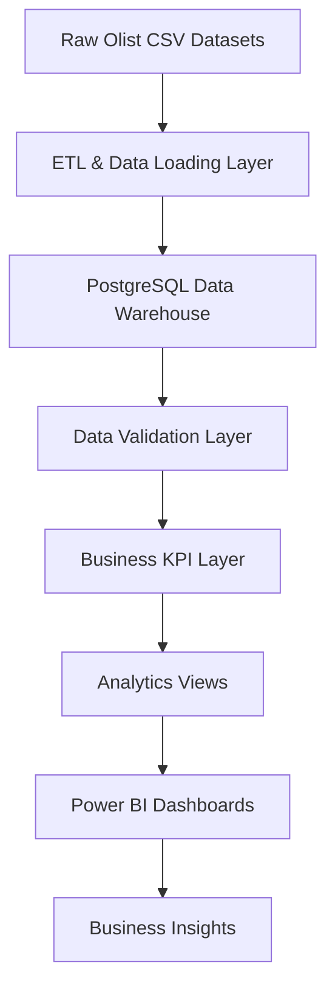
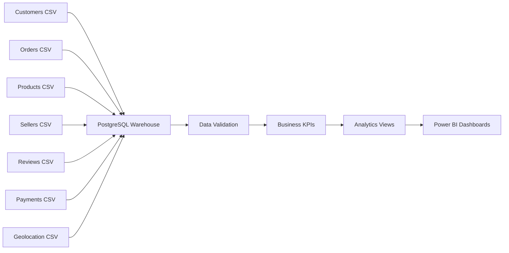
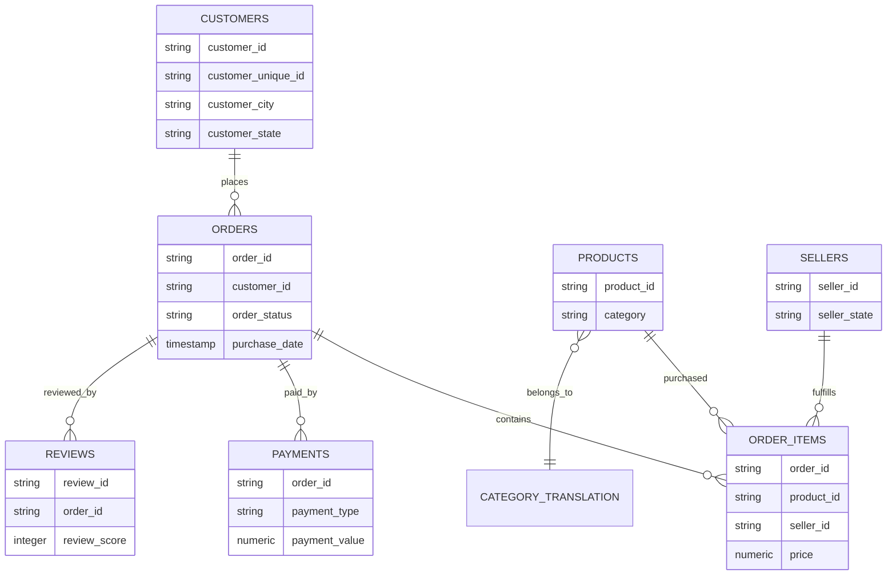
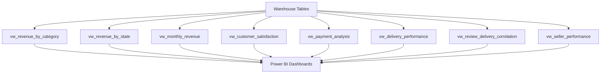
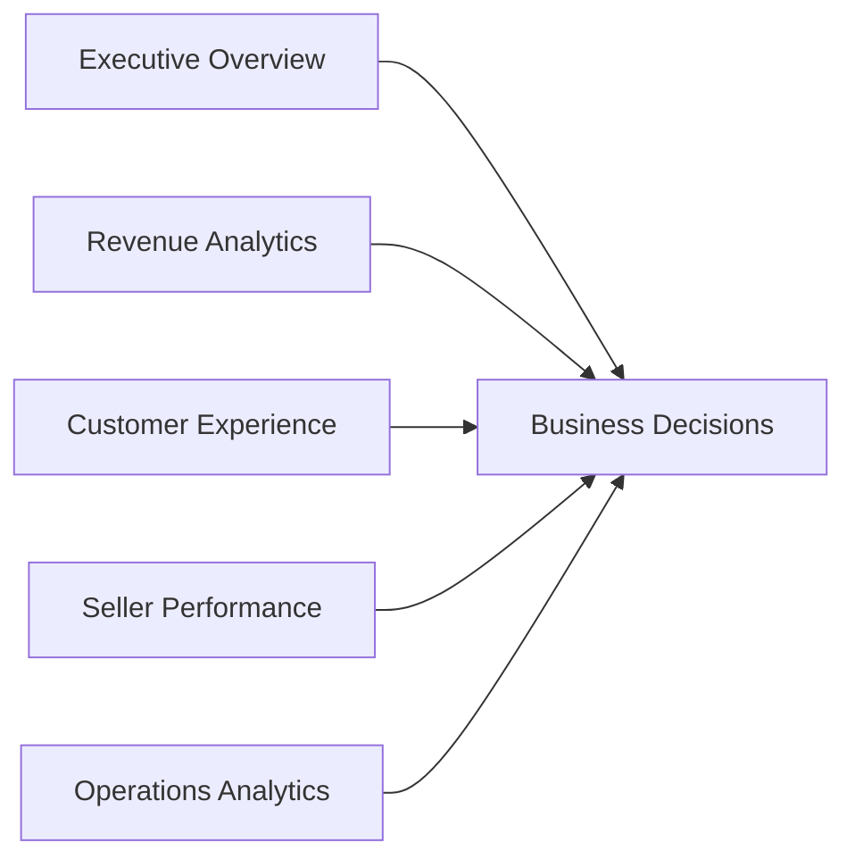

# InsightFlow – E-commerce Analytics & Business Intelligence Platform


An end-to-end analytics platform built using PostgreSQL, SQL, Docker, and Power BI to transform raw e-commerce data into actionable business insights. The project simulates a real-world analytics environment by designing a complete data warehouse, implementing ETL pipelines, validating data quality, building analytical views, and delivering executive-level business intelligence dashboards.

---

# Overview

InsightFlow is a full-stack Business Intelligence and Analytics project developed using the Brazilian Olist E-commerce Dataset. The project demonstrates the complete analytics lifecycle from raw data ingestion to dashboard-driven business insights.

The platform enables organizations to analyze:

- Revenue performance
- Customer satisfaction
- Delivery efficiency
- Payment behavior
- Seller performance
- Regional business trends

The objective is to provide stakeholders with a centralized analytics environment capable of supporting operational, financial, and customer experience decision-making.

---

# Business Problem

E-commerce companies generate large volumes of transactional data across multiple systems, including customers, orders, products, payments, reviews, and logistics.

Without a centralized analytics solution, organizations struggle to:

- Track business performance
- Monitor customer satisfaction
- Measure delivery efficiency
- Identify revenue opportunities
- Analyze seller performance
- Generate executive reports

InsightFlow addresses these challenges by creating a structured analytics warehouse and business intelligence layer capable of transforming raw data into actionable insights.

---

# Solution Architecture



---

# Data Pipeline



---

# Dataset

### Dataset Source

Brazilian Olist E-commerce Dataset

### Dataset Scale

| Entity | Records |
|----------|----------:|
| Customers | 99,441 |
| Orders | 99,441 |
| Products | 32,951 |
| Sellers | 3,095 |
| Order Items | 112,650 |
| Reviews | 99,224 |
| Payments | 103,886 |
| Geolocation | 1,000,163 |
| Category Translation | 71 |

### Total Records Processed

**~1.5 Million+ Records**

---

# Technology Stack

## Data Engineering

- PostgreSQL
- SQL
- Docker

## Analytics

- Business KPI Reporting
- Data Validation
- Query Optimization
- Analytical Views

## Visualization

- Power BI

## Version Control

- Git
- GitHub

---

# Data Warehouse Design

The warehouse was designed using a normalized relational schema consisting of multiple interconnected business entities.



---

# Database Schema

The warehouse consists of the following tables:

| Table | Purpose |
|---------|---------|
| customers | Customer master data |
| orders | Order lifecycle information |
| order_items | Product-level order details |
| products | Product catalog |
| sellers | Seller information |
| payments | Payment transactions |
| reviews | Customer review records |
| geolocation | Location and geography data |
| category_translation | Product category mapping |

Key features:

- Primary Keys
- Foreign Keys
- Referential Integrity
- Relational Modeling
- Data Validation Constraints

---

# Data Validation & Quality Assurance

Comprehensive validation checks were implemented to ensure warehouse reliability.

Validation performed:

- Orphan order detection
- Orphan product detection
- Orphan seller detection
- Orphan payment detection
- Orphan review detection
- Customer relationship validation

### Validation Result

✅ All referential integrity checks passed successfully.

---

# Business KPI Layer

The KPI layer provides standardized business metrics for reporting and analysis.

## Revenue Analytics

- Total Revenue
- Revenue by Category
- Revenue by State
- Monthly Revenue Trends

## Customer Experience Analytics

- Average Review Score
- Customer Satisfaction Analysis
- Review Distribution

## Delivery Analytics

- Average Delivery Time
- Delivery Performance Monitoring
- Delivery vs Customer Satisfaction Analysis

## Payment Analytics

- Payment Type Distribution
- Revenue by Payment Method

## Seller Analytics

- Top Performing Sellers
- Seller Revenue Analysis
- Seller Contribution Reporting

---

# Analytics Layer

The analytics layer exposes reusable business views for dashboard consumption.



---

# Analytics Views

### vw_revenue_by_category

Provides category-level revenue insights.

### vw_revenue_by_state

Provides state-wise revenue analysis.

### vw_monthly_revenue

Tracks monthly sales and revenue trends.

### vw_customer_satisfaction

Measures customer review performance.

### vw_payment_analysis

Analyzes payment method usage and payment trends.

### vw_delivery_performance

Measures operational delivery efficiency.

### vw_review_delivery_correlation

Analyzes the relationship between delivery performance and customer reviews.

### vw_seller_performance

Provides seller-level business performance analytics.

---

# Query Optimization

To support analytical workloads efficiently, performance optimization techniques were implemented.

Indexes created on:

- orders.customer_id
- order_items.order_id
- order_items.product_id
- order_items.seller_id
- payments.order_id
- reviews.order_id

Benefits:

- Faster joins
- Improved dashboard performance
- Reduced analytical query execution time
- Better scalability for large datasets

---

# Dashboard Architecture



---

# Dashboard Features

## Executive Overview Dashboard

- Revenue KPIs
- Orders KPIs
- Customer KPIs
- Review KPIs

## Revenue Analytics Dashboard

- Revenue Trends
- Revenue by Category
- Revenue by State
- Monthly Growth Analysis

## Customer Experience Dashboard

- Review Analysis
- Customer Satisfaction Metrics
- Review Score Distribution

## Seller Performance Dashboard

- Top Sellers
- Revenue Contribution
- Seller Comparison

## Operations Dashboard

- Delivery Performance
- Fulfillment Metrics
- Operational Efficiency Analysis

---

# Key Business Insights

### Revenue

- Total Revenue Generated: 16M+
- Top-performing product categories identified
- Regional revenue concentration analyzed

### Customer Experience

- Average Review Score: 4.09 / 5
- Customer satisfaction patterns identified

### Operations

- Average Delivery Time: 12.56 Days
- Delivery efficiency impact on customer reviews analyzed

### Payments

- Credit cards accounted for the majority of transactions
- Payment preferences analyzed across customer segments

### Sellers

- Top revenue-generating sellers identified
- Seller contribution to overall marketplace revenue measured

---

# KPI Summary

| KPI | Description |
|---------|-------------|
| Total Revenue | Overall business revenue |
| Total Orders | Number of completed orders |
| Average Review Score | Customer satisfaction indicator |
| Average Delivery Time | Operational efficiency metric |
| Revenue by Category | Product performance analysis |
| Revenue by State | Regional business analysis |
| Payment Mix | Customer payment behavior |
| Seller Revenue | Seller performance metric |

---

# Dashboard Preview

### Executive Overview Dashboard


### Revenue Analytics Dashboard


### Customer Experience Dashboard


### Seller Performance Dashboard


---

# Repository Structure

```text
insightflow/
│
├── data/
│   └── raw/
│
├── docs/
│   └── schema_design.md
│
├── sql/
│   ├── 001_create_tables.sql
│   ├── 002_load_data.sql
│   ├── 003_validation_queries.sql
│   ├── 004_business_kpis.sql
│   ├── 005_views.sql
│   └── 006_indexes.sql
│
├── images/
│   ├── executive_dashboard.png
│   ├── revenue_dashboard.png
│   ├── customer_dashboard.png
│   └── seller_dashboard.png
│
├── docker-compose.yml
│
└── README.md
```

---

# Skills Demonstrated

- SQL
- PostgreSQL
- Data Warehousing
- Data Modeling
- ETL Development
- Data Validation
- Data Analytics
- Business Intelligence
- Dashboard Development
- Query Optimization
- KPI Reporting
- Customer Experience Analytics
- Revenue Analytics
- Data Visualization
- Docker
- Git
- GitHub

---

# Future Enhancements

- Incremental Data Loading
- Automated ETL Pipelines
- Power BI Service Deployment
- Real-Time Data Processing
- Customer Segmentation Models
- Predictive Analytics
- Forecasting Dashboards

---

# Author

**Abhishek Singh**

Computer Science & Data Science Engineering

Interested in Data Analytics, Business Intelligence, Data Engineering, Customer Experience Analytics, and Product Analytics.

---
⭐ If you found this project useful, consider starring the repository.
